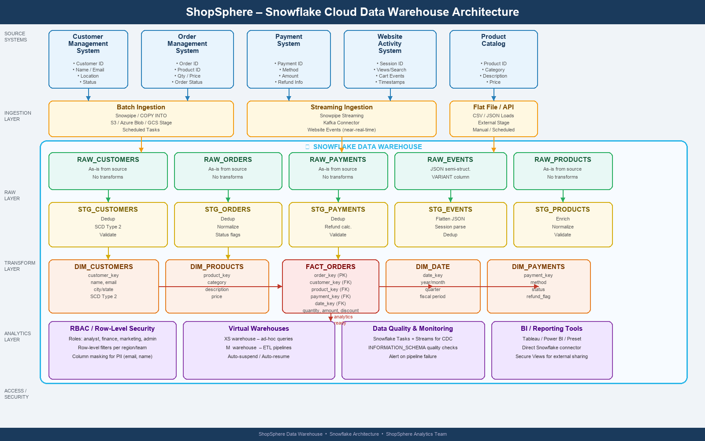

# ❄️ ShopSphere – Snowflake Data Warehouse Practice

> A complete, end-to-end Snowflake data warehouse project built on the **Olist Brazilian E-Commerce** dataset.  
> Covers every layer from raw ingestion to analytics-ready star schema, with automated pipelines, data quality checks, SCD Type 2, Dynamic Tables, and audit logging.

---

## 📋 Table of Contents

1. [Project Overview](#1-project-overview)
2. [Architecture](#2-architecture)
3. [Dataset](#3-dataset)
4. [Database Design](#4-database-design)
5. [Grain Definitions](#5-grain-definitions)
6. [SQL Scripts – Run Order](#6-sql-scripts--run-order)
7. [Pipeline Architecture](#7-pipeline-architecture)
8. [Business Analytics Enabled](#8-business-analytics-enabled)
9. [Repository Structure](#9-repository-structure)

---
## TO VIEW THE TASKS
https://chatgpt.com/share/6ac8b8f4-0124-83e8-afff-f1cc6ff6bedf(click here)

## 1. Project Overview

ShopSphere is a rapidly growing Indian e-commerce company selling electronics, clothing, books, and household products. Data lives across **four isolated systems** — Customer Management, Order Management, Payment, and Website Activity — making it impossible to get a single consistent view.

**Goal:** Build a centralized cloud data warehouse on Snowflake that integrates all sources and delivers reliable, historical, analytics-ready data.

### Business Problems Solved

| Problem | Solution |
|---|---|
| Customer data separated from orders and payments | Unified star schema with `FACT_ORDER_ITEMS` joined to `DIM_CUSTOMERS` |
| No single purchase journey view | `CUSTOMER_UNIQUE_ID` tracked across all orders |
| Payment failures hard to analyse | `FACT_PAYMENTS` with type flags and reconciliation checks |
| Historical customer changes lost | SCD Type 2 on `DIM_CUSTOMERS` and `DIM_PRODUCTS` |
| Duplicate and inconsistent data | Deduplication via `QUALIFY ROW_NUMBER()` in Dynamic Tables |
| Manual reporting pipelines | Automated Task DAG running every 5 minutes |

---

## 2. Architecture



### Layer Overview

```
CSV Files (Local / S3 / Stage)
        │
        │  COPY INTO / Snowpipe
        ▼
  RAW Schema  ──────────── as-is source data, no transforms, append-only
        │
        │  Dynamic Tables (auto-refresh, TARGET_LAG = 1 min)
        ▼
  STAGING.DT_* ─────────── cleaned, deduped, enriched, validated
        │
        │  Streams (DEFAULT / APPEND_ONLY) + Task DAG (every 5 min)
        ▼
  MARTS Schema ─────────── star schema: 3 facts + 5 dimensions
        │
        │  Secure Views / Roles
        ▼
  BI Tools (Tableau / Power BI / Preset)
        │
        │  Leaf Task → Stored Procedure
        ▼
  AUDIT Schema ─────────── pipeline runs + DQ check results
```

### Schemas

| Schema | Purpose |
|---|---|
| `RAW` | As-is landing zone — no transforms, `_ROW_HASH` for dedup |
| `STAGING` | Dynamic Tables (`DT_*`) — auto-refreshing clean layer |
| `MARTS` | Star schema — `FACT_*` and `DIM_*` tables for BI |
| `COMMON` | Lookup tables (e.g. `LKP_CATEGORY_NAMES`) |
| `AUDIT` | `AUD_PIPELINE_RUNS` and `AUD_DQ_CHECKS` |

---

## 3. Dataset

Source: **Olist Brazilian E-Commerce** public dataset — real transaction data from 2016–2018.

| File | Rows | Description |
|---|---|---|
| `olist_customers_dataset.csv` | 99,441 | Customer IDs, city, state, ZIP |
| `olist_geolocation_dataset.csv` | 1,000,163 | GPS lat/lng samples per ZIP prefix |
| `olist_orders_dataset.csv` | 99,441 | Order lifecycle — purchase → delivery |
| `olist_order_items_dataset.csv` | 112,650 | Line items — product, seller, price, freight |
| `olist_order_payments_dataset.csv` | 103,886 | Payment method, installments, amount |
| `olist_order_reviews_dataset.csv` | 104,164 | 1–5 star ratings + optional comments |
| `olist_products_dataset.csv` | 32,951 | Product dimensions and category (Portuguese) |
| `olist_sellers_dataset.csv` | 3,095 | Seller city, state, ZIP |
| `product_category_name_translation.csv` | 71 | Portuguese → English category names |

> All 9 files are **structured CSV** — loaded via `COPY INTO` with `FF_CSV_HEADER` file format.

---

## 4. Database Design

### Naming Conventions

| Identifier | Convention | Example |
|---|---|---|
| All identifiers | `UPPER_SNAKE_CASE` | `FACT_ORDER_ITEMS` |
| Primary keys (surrogate) | `<ENTITY>_KEY` | `CUSTOMER_KEY` |
| Natural keys | `<ENTITY>_ID` or `_NK` suffix | `ORDER_ID`, `PRODUCT_ID_NK` |
| Timestamps | `_AT` (datetime) / `_DT` (date only) | `PURCHASE_TS`, `ORDER_DT` |
| Boolean flags | `IS_` or `HAS_` prefix | `IS_DELIVERED`, `HAS_COMMENT` |
| Monetary amounts | `_AMT` suffix | `PRICE_AMT`, `FREIGHT_AMT` |
| Audit columns | `_LOADED_AT`, `_SOURCE_FILE`, `_ROW_HASH` | on every RAW table |

### Schema Structure

```
SHOPSPHERE_DW
├── RAW
│   ├── RAW_CUSTOMERS
│   ├── RAW_GEOLOCATION
│   ├── RAW_ORDERS
│   ├── RAW_ORDER_ITEMS
│   ├── RAW_ORDER_PAYMENTS
│   ├── RAW_ORDER_REVIEWS
│   ├── RAW_PRODUCTS
│   └── RAW_SELLERS
│
├── STAGING  (Dynamic Tables — DT_*)
│   ├── DT_CUSTOMERS        ← INITCAP city, LOWER IDs, QUALIFY dedup
│   ├── DT_GEOLOCATION      ← AVG lat/lng centroid per ZIP
│   ├── DT_ORDERS           ← UPPER status, IS_LATE, DELIVERY_DELAY_DAYS
│   ├── DT_ORDER_ITEMS      ← ROUND prices, TOTAL_ITEM_AMT derived
│   ├── DT_ORDER_PAYMENTS   ← UPPER type, boolean flags
│   ├── DT_ORDER_REVIEWS    ← NULLIF blanks, sentiment flags, dedup per order
│   ├── DT_PRODUCTS         ← LEFT JOIN English category name
│   └── DT_SELLERS          ← INITCAP city, UPPER state
│
├── MARTS  (Star Schema)
│   ├── FACT_ORDER_ITEMS    ← grain: order line item  (primary fact)
│   ├── FACT_PAYMENTS       ← grain: payment entry
│   ├── FACT_REVIEWS        ← grain: review submission
│   ├── DIM_CUSTOMERS       ← SCD Type 2 (tracks city/state/ZIP changes)
│   ├── DIM_PRODUCTS        ← SCD Type 2 (tracks category changes)
│   ├── DIM_SELLERS         ← Type 1 (latest values)
│   ├── DIM_GEOGRAPHY       ← ZIP centroid lookup
│   └── DIM_DATE            ← Calendar 2015–2030
│
├── COMMON
│   └── LKP_CATEGORY_NAMES
│
└── AUDIT
    ├── AUD_PIPELINE_RUNS
    └── AUD_DQ_CHECKS
```

---

## 5. Grain Definitions

The **grain** defines exactly what one row represents in each table.

| Table | Grain | Key |
|---|---|---|
| `RAW_CUSTOMERS` / `DT_CUSTOMERS` | One customer–order identity | `CUSTOMER_ID` |
| `DT_GEOLOCATION` | One GPS centroid per ZIP prefix | `ZIP_CODE_PREFIX` |
| `RAW_ORDERS` / `DT_ORDERS` | One order | `ORDER_ID` |
| `RAW_ORDER_ITEMS` / `DT_ORDER_ITEMS` | One line item within an order | `ORDER_ID + ORDER_ITEM_ID` |
| `RAW_ORDER_PAYMENTS` / `DT_ORDER_PAYMENTS` | One payment entry per order | `ORDER_ID + PAYMENT_SEQUENTIAL` |
| `RAW_ORDER_REVIEWS` / `DT_ORDER_REVIEWS` | One review per order (latest) | `REVIEW_ID` |
| `RAW_PRODUCTS` / `DT_PRODUCTS` | One product SKU | `PRODUCT_ID` |
| `RAW_SELLERS` / `DT_SELLERS` | One seller | `SELLER_ID` |
| `FACT_ORDER_ITEMS` | One order line item | `ORDER_ITEM_KEY` (surrogate) |
| `FACT_PAYMENTS` | One payment entry | `PAYMENT_KEY` (surrogate) |
| `FACT_REVIEWS` | One review | `REVIEW_KEY` (surrogate) |
| `DIM_CUSTOMERS` | One customer version (SCD2) | `CUSTOMER_KEY` (surrogate) |
| `DIM_PRODUCTS` | One product version (SCD2) | `PRODUCT_KEY` (surrogate) |

> ⚠️ `CUSTOMER_ID` is **not** a unique person identifier — one person can have multiple `CUSTOMER_ID` values across orders. Use `CUSTOMER_UNIQUE_ID` for person-level analysis.

---

## 6. SQL Scripts – Run Order

| # | File | Purpose |
|---|---|---|
| 1 | [`sql/01_setup_and_load.sql`](sql/01_setup_and_load.sql) | Database, schemas, warehouses, file format, internal stage, RAW table DDL, `COPY INTO` |
| 2 | [`sql/03_data_quality.sql`](sql/03_data_quality.sql) | Deduplication, reference integrity, validity flags, value validation, DQ results table |
| 3 | [`sql/04_marts_star_schema.sql`](sql/04_marts_star_schema.sql) | Dimension + fact DDL, initial full load, SCD Type 2 merge pattern, late-arriving data |
| 4 | [`sql/06_dynamic_tables_and_pipeline.sql`](sql/06_dynamic_tables_and_pipeline.sql) | Dynamic Tables on RAW, streams on DT_*, Task DAG, `SP_AUDIT_PIPELINE` stored procedure |

> **Note:** `02_staging_standardize.sql` and `05_streams_and_tasks.sql` are **superseded** by `06` — Dynamic Tables replace the manual staging inserts; the `06` Task DAG replaces the `05` stream/task setup.

### Running the pipeline

**Step 1 — Snowflake Worksheet** (Sections 1–4, 6 of `01`):
```sql
USE DATABASE SHOPSPHERE_DW;
-- Run 01_setup_and_load.sql sections 1–4 and 6
```

**Step 2 — SnowSQL CLI** (`PUT` commands — cannot run in browser worksheet):
```bash
snowsql -a <account> -u <username>
PUT file://C:/Users/.../snowflake_dataset/*.csv @SHOPSPHERE_DW.RAW.STG_OLIST_STAGE AUTO_COMPRESS=TRUE;
```

**Step 3 — Snowflake Worksheet** (COPY INTO + verify):
```sql
-- Run sections 7–8 of 01_setup_and_load.sql
```

**Step 4 — Run remaining scripts in order:**
```sql
-- 03_data_quality.sql   → DQ checks
-- 04_marts_star_schema.sql → initial MARTS load
-- 06_dynamic_tables_and_pipeline.sql → activate live pipeline
```

---

## 7. Pipeline Architecture

### Dynamic Tables (auto-refresh layer)

Dynamic Tables replace manual staging inserts. They are pure SQL `SELECT` definitions that Snowflake refreshes automatically within 1 minute of RAW changes.

| What they handle | What they don't handle |
|---|---|
| TRIM / INITCAP / UPPER / LOWER | SCD Type 2 expire + insert |
| ROUND / COALESCE for monetary values | Surrogate key resolution |
| Derived boolean flags | Conditional MERGE logic |
| QUALIFY dedup | Multi-step audit logging |
| LEFT JOIN enrichment | |
| AVG aggregation for geolocation | |

### Task DAG

```
TASK_DT_MASTER_TRIGGER  (every 5 min)
        │
   ┌────┼────────┐
   │    │        │
DIM_  DIM_     DIM_
CUST  PROD     SELL
   │    │        │
   └────┼────────┘
        │  (all dims complete first)
   ┌────┼────────┐
   │    │        │
FACT_ FACT_   FACT_
ITEMS PMTS    REVWS
   │    │        │
   └────┼────────┘
        │
 TASK_DT_AUDIT_LOG
 → CALL SP_AUDIT_PIPELINE(6)
```

### `SP_AUDIT_PIPELINE` — 4-step stored procedure

1. Count rows loaded across all 3 fact tables in the run window
2. Run DQ spot-checks (null surrogate keys, negative prices, bad review scores)
3. Write one row per check to `AUDIT.AUD_DQ_CHECKS`
4. Write one pipeline summary row to `AUDIT.AUD_PIPELINE_RUNS` (status: `SUCCESS` / `PARTIAL`)

### SCD Type 2 Pattern (DIM_CUSTOMERS & DIM_PRODUCTS)

When a customer moves city or a product changes category:

1. **Expire** old row: `SCD_END_DT = today - 1`, `IS_CURRENT = FALSE`
2. **Insert** new row: `SCD_START_DT = today`, `SCD_END_DT = NULL`, `IS_CURRENT = TRUE`

Historical fact rows keep pointing to the old surrogate key → **historical accuracy preserved**.

### Virtual Warehouses

| Warehouse | Size | Purpose | Auto-Suspend |
|---|---|---|---|
| `WH_XS_ADHOC` | X-Small | Ad-hoc analyst queries | 60 s |
| `WH_M_ETL` | Medium | ETL pipeline tasks | 120 s |
| `WH_S_REPORTING` | Small | Scheduled BI refreshes | 300 s |

---

## 8. Business Analytics Enabled

The MARTS layer directly answers the 12 business questions from the BRD:

| Question | Tables Used |
|---|---|
| Daily / monthly / yearly sales | `FACT_ORDER_ITEMS` + `DIM_DATE` |
| Highest revenue products & categories | `FACT_ORDER_ITEMS` + `DIM_PRODUCTS` |
| Top customers by revenue | `FACT_ORDER_ITEMS` + `DIM_CUSTOMERS` |
| Order cancellation & delivery rate | `FACT_ORDER_ITEMS`.`IS_CANCELED` / `IS_DELIVERED` |
| Payment method failure rate | `FACT_PAYMENTS`.`PAYMENT_TYPE` |
| Total refunds | `FACT_PAYMENTS` where `IS_VOUCHER = TRUE` |
| Product views without purchase | (future: website activity semi-structured layer) |
| View → cart → purchase conversion | (future: website activity semi-structured layer) |
| Revenue by city / region | `FACT_ORDER_ITEMS` + `DIM_CUSTOMERS`.`STATE` / `DIM_GEOGRAPHY` |
| Customer behaviour over time | `FACT_ORDER_ITEMS` + `DIM_DATE` + `DIM_CUSTOMERS` |
| Repeat vs one-time customers | `FACT_ORDER_ITEMS` GROUP BY `CUSTOMER_UNIQUE_ID` |
| Average Order Value (AOV) | `AVG(TOTAL_ITEM_AMT)` on `FACT_ORDER_ITEMS` |

### Role-based Access

| Role | Access |
|---|---|
| `ROLE_ENGINEER` | All schemas (read/write) |
| `ROLE_ANALYST` | `MARTS` + `COMMON` (read only) |
| `ROLE_FINANCE` | `FACT_PAYMENTS` + `DIM_*` (read only) |
| `ROLE_MARKETING` | `MARTS` (read only, PII masked) |
| `ROLE_MONITOR` | `AUDIT` (read only) |

---

## 9. Repository Structure

```
snowflake_practice/
│
├── README.md                          ← This file
├── business_requirement.md            ← BRD — objectives, problems, requirements
├── database_design.md                 ← Naming conventions, schema structure, DDL specs
├── grain_definition.md                ← What one row means in each table
├── architecture.png                   ← Architecture diagram (PNG)
│
├── snowflake_dataset/                 ← Olist CSV source files (9 files)
│   ├── olist_customers_dataset.csv
│   ├── olist_geolocation_dataset.csv
│   ├── olist_orders_dataset.csv
│   ├── olist_order_items_dataset.csv
│   ├── olist_order_payments_dataset.csv
│   ├── olist_order_reviews_dataset.csv
│   ├── olist_products_dataset.csv
│   ├── olist_sellers_dataset.csv
│   └── product_category_name_translation.csv
│
└── sql/                               ← Snowflake SQL scripts (run in order)
    ├── 01_setup_and_load.sql          ← DB, schemas, stage, RAW tables, COPY INTO
    ├── 02_staging_standardize.sql     ← [Superseded by 06] Manual staging inserts
    ├── 03_data_quality.sql            ← Dedup, ref integrity, validity, DQ results table
    ├── 04_marts_star_schema.sql       ← Star schema DDL + initial load + SCD2 + late data
    ├── 05_streams_and_tasks.sql       ← [Superseded by 06] Streams on STG_* tables
    └── 06_dynamic_tables_and_pipeline.sql  ← Dynamic Tables + Streams + Task DAG + Audit SP
```

---

*ShopSphere Snowflake Practice — built with ❄️ Snowflake · 📊 Olist Dataset · 🔧 SQL*

